# ⚡ Marketing Campaign Intelligence & Multi-Channel Attribution Suite

[](https://www.python.org/)
[](https://streamlit.io/)
[](https://plotly.com/)
[](https://docs.pytest.org/)
[](https://github.com/astral-sh/ruff)
[](LICENSE)

> **An enterprise-grade, interactive executive analytics suite and econometric simulation engine designed to evaluate multi-channel marketing efficiency, conversion funnel bottlenecks, and capital reallocation across Google, Meta (Facebook & Instagram), LinkedIn, Email, and YouTube.**

🔗 **Live Interactive Application:** [Launch Live Executive Dashboard](https://marketing-campaign-intelligence.streamlit.app/) *(Placeholder)*

---

## 📌 Executive Summary & Business Objective

Modern performance marketing teams manage millions in media capital across disparate platforms with divergent attribution windows, varying unit economics, and shifting seasonal demand. Marketing leaders frequently struggle with:
1. **Capital Misallocation:** Sunk spend in saturated or low-intent acquisition channels while high-ROI retention channels remain starved of budget.
2. **Attribution & Aggregation Pitfalls:** Flawed KPI rollups that average row-level ratios (e.g., mean of ROAS) across campaigns, leading to severe Simpson's Paradox distortions.
3. **Black-Box Scenario Planning:** Lack of empirical simulation tools to quantify the revenue impact of budget shifts under realistic diminishing marginal returns.

### Core Objective
This repository delivers an end-to-end analytics engineering pipeline and a production-grade 4-tab Streamlit dashboard that:
- Ingests, validates, cleans, and standardizes multi-channel campaign telemetry (**214 validated campaigns**, evaluating **₹2.64Cr media spend** and **₹3.74Cr gross revenue**).
- Computes standardized portfolio KPIs using a mathematically rigorous metrics engine (strictly summing numerators and denominators).
- Delivers a 3-month predictive forecasting engine using Holt's Exponential Smoothing with 95% parametric confidence intervals.
- Provides a what-if econometric budget optimizer modeling power-law response curves ($\beta = 0.85$) to simulate optimal capital reallocation.

---

## 📊 Dataset Architecture & Schema

The underlying dataset models multi-channel performance telemetry across 6 distinct digital channels in the Indian market from **January 2025 through September 2026**.

| Column Name | Data Type | Description | Sample Values / Range |
| :--- | :---: | :--- | :--- |
| `Campaign ID` | `string` | Unique alphanumeric primary key | `CMP-2025-001`, `CMP-2026-145` |
| `Campaign Name` | `string` | Descriptive campaign nomenclature | `Google_LeadGen_Students_No` |
| `Campaign Type` | `string` | Marketing objective / tactical focus | `Lead Generation`, `Brand Awareness`, `Seasonal Sale`, `Retargeting` |
| `Platform` | `string` | Advertising channel | `Google`, `Facebook`, `Instagram`, `LinkedIn`, `Email`, `YouTube` |
| `Campaign Start Date`| `date` | Campaign flight launch date (ISO 8601) | `2025-01-15` |
| `Campaign End Date` | `date` | Campaign flight conclusion date (ISO 8601) | `2025-02-14` |
| `Duration Days` | `integer` | Active flight duration in calendar days | `7` to `45` days |
| `Year` | `integer` | Flight calendar year | `2025`, `2026` |
| `Quarter` | `string` | Calendar quarter | `Q1`, `Q2`, `Q3`, `Q4` |
| `Month` | `string` | Chronological month-year grouping | `Jan 2025` to `Sep 2026` |
| `Region` | `string` | Target Indian geographic region | `North`, `South`, `East`, `West`, `Central`, `North-East` |
| `Audience Segment` | `string` | Targeted customer demographic cohort | `Enterprise Decision Makers`, `Small Business Owners`, `Students`, etc. |
| `Impressions` | `integer` | Total top-of-funnel ad views logged | `10,000` to `2,400,000` |
| `Clicks` | `integer` | Total user interactions/clicks logged | `20` to `35,000` |
| `CTR %` | `float` | Click-Through Rate ($Clicks / Impressions$) | `0.15%` to `4.80%` |
| `Leads Generated` | `integer` | Mid-funnel inquiries / form submissions | `5` to `8,500` |
| `Conversions` | `integer` | Bottom-of-funnel paying customer acquisitions | `1` to `3,200` |
| `Conversion Rate %` | `float` | Click-to-Customer conversion percentage | `0.50%` to `18.50%` |
| `Lead Conv Rate %` | `float` | Lead-to-Customer qualification rate | `10.0%` to `65.0%` |
| `Marketing Spend` | `float` | Total media budget expended (in ₹) | `₹3,500` to `₹24,80,000` |
| `Revenue Generated` | `float` | Attributed gross top-line revenue (in ₹) | `₹4,200` to `₹36,50,000` |
| `ROI %` | `float` | Return on Investment ($(Rev - Spend) / Spend$) | `-60.0%` to `+350.0%` |
| `ROAS` | `float` | Return on Ad Spend ($Revenue / Spend$) | `0.40x` to `4.50x` |
| `CPC` | `float` | Effective Cost Per Click ($Spend / Clicks$) | `₹4.50` to `₹420.00` |
| `CPM` | `float` | Effective Cost Per Mille ($Spend / Impr \times 1000$) | `₹25.00` to `₹650.00` |
| `CAC` | `float` | Customer Acquisition Cost ($Spend / Conv$) | `₹15.00` to `₹3,200.00` |
| `Customer Acq Cost` | `float` | Normalized CAC alias for reporting parity | `₹15.00` to `₹3,200.00` |
| `CPL` | `float` | Cost Per Lead ($Spend / Leads$) | `₹8.00` to `₹850.00` |
| `is_outlier` | `boolean` | Flag indicating statistical spend outlier | `True`, `False` |
| `outlier_reason` | `string` | Analytical explanation for outlier tag | `Google Spend > Q3 + 1.5*IQR`, `None` |

---

## 🛠️ Data Engineering & Cleaning Pipeline

The raw ingestion dataset contained realistic enterprise data defects (6 duplicate records, ~4% missing values, mixed date formats, inverted timestamps, and platform spelling variations). The pipeline in [`src/clean_data.py`](file:///src/clean_data.py) executes a 6-step audit:

1. **Deduplication via Attribute Completeness:** Duplicate `Campaign ID` instances were audited; rather than arbitrarily dropping rows, the pipeline retains the record with the maximum non-null attribute count.
2. **Chronological Inversion Repair:** 3 records where `Campaign End Date < Campaign Start Date` were identified. Rather than discarding telemetry, the pipeline chronologically swaps `min(Start, End)` and `max(Start, End)`, restoring correct flight durations (7 to 45 days).
3. **Categorical Entity Normalization:** Cleaned divergent abbreviations and casing variants (`fb`, `FB`, `google ads`, `Insta`, `linkedin `, `youtube`) into 6 standardized channels.
4. **Domain-Principled Missing Value Imputation:**
   - Missing clicks, leads, conversions, and revenue are imputed using **channel-specific median conversion rates and ROAS**, preserving true cross-channel performance characteristics.
   - Enforces strict physical funnel integrity: $Impressions \ge Clicks \ge Leads \ge Conversions \ge 1$.
5. **Platform-Level IQR Outlier Tagging:** Identifies extreme spend records using interquartile range thresholds ($Q_3 + 1.5 \times IQR$) calculated **per advertising platform**. Rather than deleting records, rows are labeled with `is_outlier = True` to enable executive toggle auditing.
6. **Recomputation of Standard Metrics:** All downstream KPIs, durations, and temporal partitions (`Year`, `Quarter`, `Month`) are recomputed to ensure complete internal consistency.

---

## 📐 Metric Definitions & Mathematical Rules

### The Golden Rule of Marketing Aggregation
> [!IMPORTANT]
> **NEVER average row-level ratios across campaigns or dimensions.**
> Averaging ratios of differing denominators produces Simpson's Paradox. For example, averaging a ₹1,000 campaign with a 900% ROI and a ₹1,00,000 campaign with a -50% ROI yields a falsely positive mean of `+425%`, whereas the true business outcome is a net loss of `-₹41,000` (`-40.59%` ROI).
> 
> In this repository, all aggregations strictly divide the **SUM of numerators by the SUM of denominators**:
> $$\text{Portfolio ROI \%} = \frac{\sum \text{Revenue} - \sum \text{Spend}}{\sum \text{Spend}} \times 100$$
> $$\text{Blended CAC} = \frac{\sum \text{Marketing Spend}}{\sum \text{Conversions}}$$

```python
# Verified mathematical implementation in src/metrics.py
def calculate_kpis(df: pd.DataFrame) -> Dict[str, Any]:
    total_spend = float(df["Marketing Spend"].sum())
    total_revenue = float(df["Revenue Generated"].sum())
    total_conversions = int(df["Conversions"].sum())
    
    roi_pct = round(safe_divide(total_revenue - total_spend, total_spend) * 100, 2)
    cac = round(safe_divide(total_spend, total_conversions), 2)
    return {"total_spend": total_spend, "total_revenue": total_revenue, "roi_pct": roi_pct, "cac": cac}
```

---

## 🖥️ Executive Dashboard Architecture

The dashboard is built on **Streamlit** and styled with a custom dark-gold design language (`#0D0E11` obsidian background, `#1A1B1F` card containers, `#E9A94B` warm amber accents, and clean typography).

### 1. Multi-Tab Navigation
- **Executive Overview:** High-level KPI scorecards, period-over-period delta badges, monthly spend vs. revenue area trajectory, platform benchmark capsule bars, donut conversion funnel, India geographic performance map, and campaign leaderboard.
- **Channel Insights:** Cross-channel efficiency quadrant (Spend vs. ROAS vs. Conversions), spend/revenue share breakdown, and a **3-Month Statistical Forecast** using Holt's Exponential Smoothing with 95% confidence bands.
- **Campaign Drill-Down:** Single-campaign selector displaying daily run-rates, campaign-specific 4-stage funnel with drop-off diagnostics, benchmark variance against channel averages, and automated plain-English strategic verdicts.
- **Budget Optimiser:** Interactive simulation sandbox with platform budget reallocation sliders, powered by a diminishing-returns response curve ($\beta = 0.85$). Shows real-time Before vs. After scorecards.

### 2. Collapsible Side Navigation Panel
- Streamlined sidebar toggle buttons (`<<` collapse and `>>` expand) styled with gold accents and smooth CSS transitions.
- Global dynamic filter controls: Date Range Picker, Multi-Select Channels, Regions, Audience Segments, Campaign Types, Outlier Toggle, and Target ROI Benchmark slider.

### 3. Screenshot Gallery

The dashboard telemetry, executive KPI scorecards, visual analytics, and scenario modeling have been captured in ultra-high-resolution (1920x1200 @ 2x DPR):

#### 🌟 Primary Dashboard & KPI Scorecards
| Executive Overview (Full Page) | Dual-Tier KPI Scorecards |
| :---: | :---: |
| [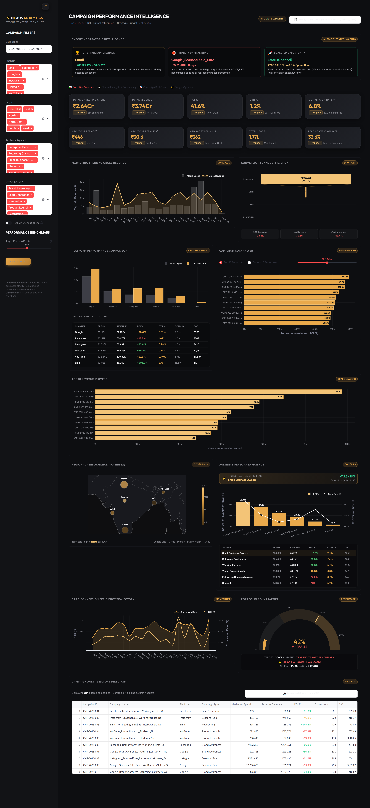](screenshots/01_full_dashboard.png) | [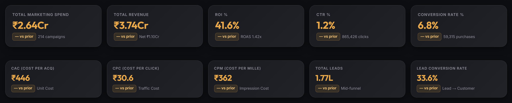](screenshots/02_kpi_cards.png) |
| *Full Executive Overview dashboard showcasing telemetry, scorecards, and multi-channel performance* | *10 dual-tier scorecards displaying Spend, Revenue, Net Profit, Blended ROI, ROAS, CAC, CPC, and CTR with period deltas* |

#### 📊 Performance Visualizations & Conversion Funnel
| Campaign ROI Analysis & Leaderboard | Platform Performance & Efficiency Matrix |
| :---: | :---: |
| [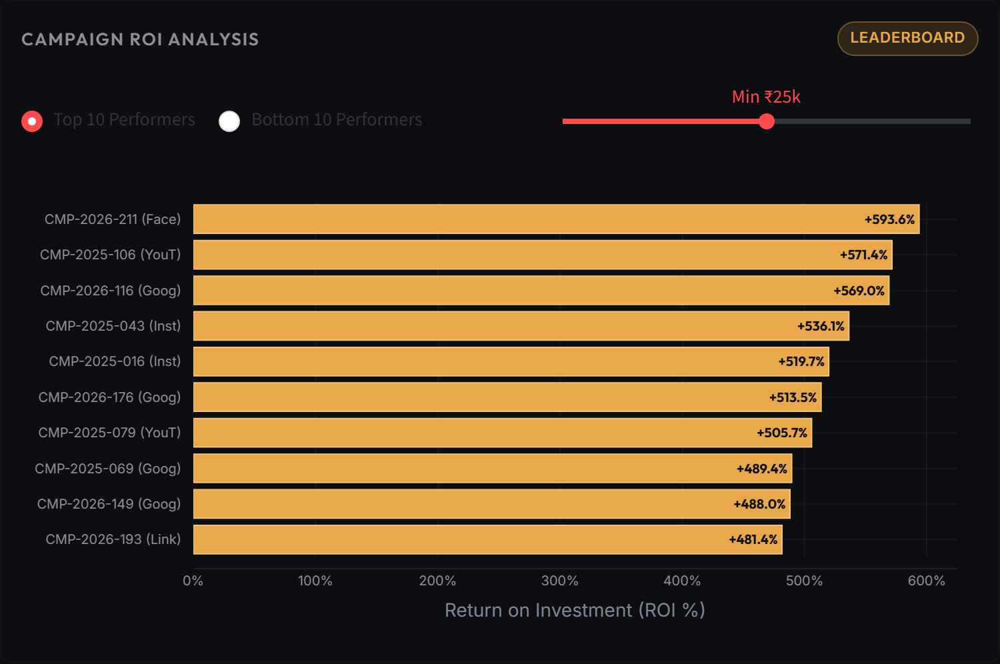](screenshots/03_campaign_performance.png) | [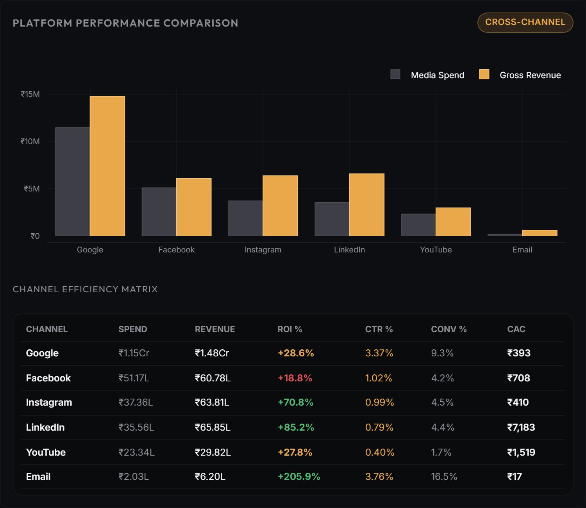](screenshots/04_platform_comparison.png) |
| *Top revenue drivers vs. ROI leaders against executive target ROI benchmarks* | *Cross-channel capital efficiency, volume delivery, and efficiency metrics* |

| Conversion Funnel & Stage Drop-Off | Monthly Spend vs. Gross Revenue Trajectory |
| :---: | :---: |
| [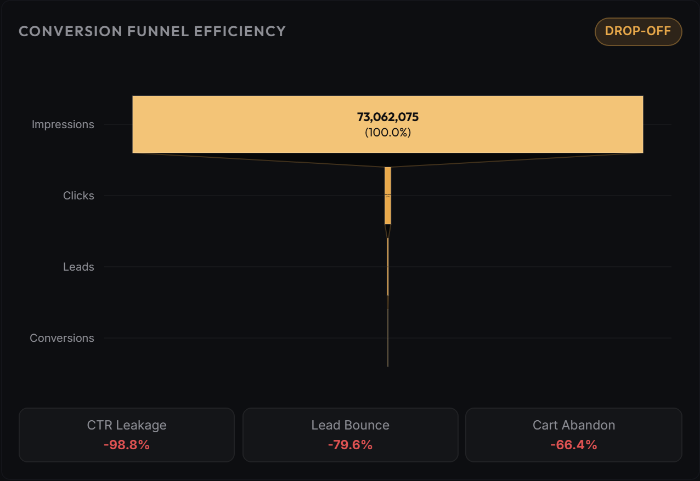](screenshots/05_conversion_funnel.png) | [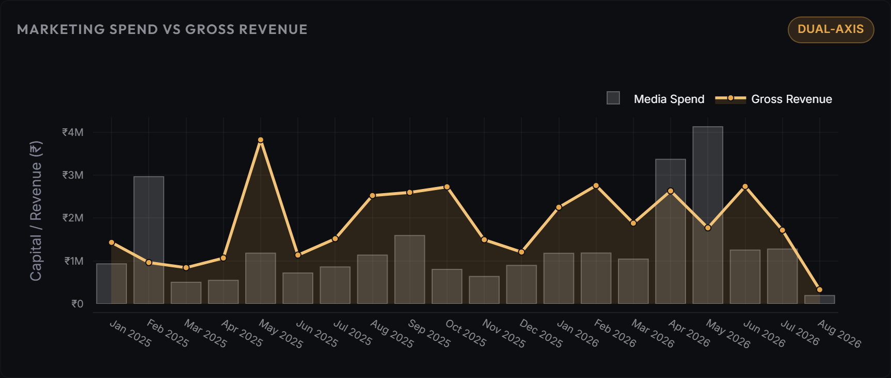](screenshots/06_spend_vs_revenue.png) |
| *4-stage funnel (Impressions → Clicks → Leads → Conversions) with micro drop-off diagnostics* | *Monthly expenditure area bars vs. gross revenue gold line demonstrating seasonal surge* |

#### 🗺️ Geographic Performance & Cohort Intelligence
| Audience Persona Efficiency Cohorts | India Regional Performance Map |
| :---: | :---: |
| [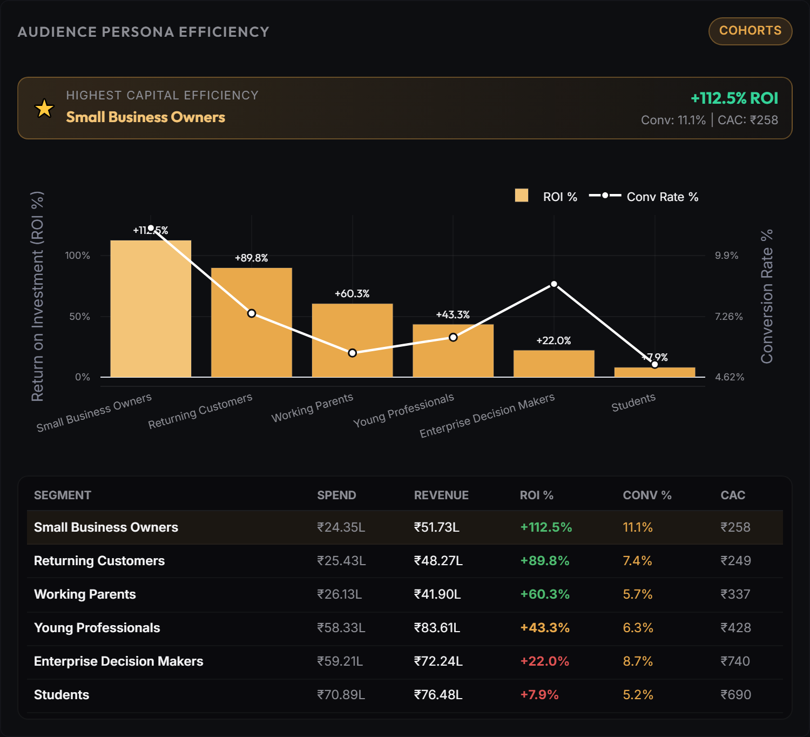](screenshots/07_audience_segments.png) | [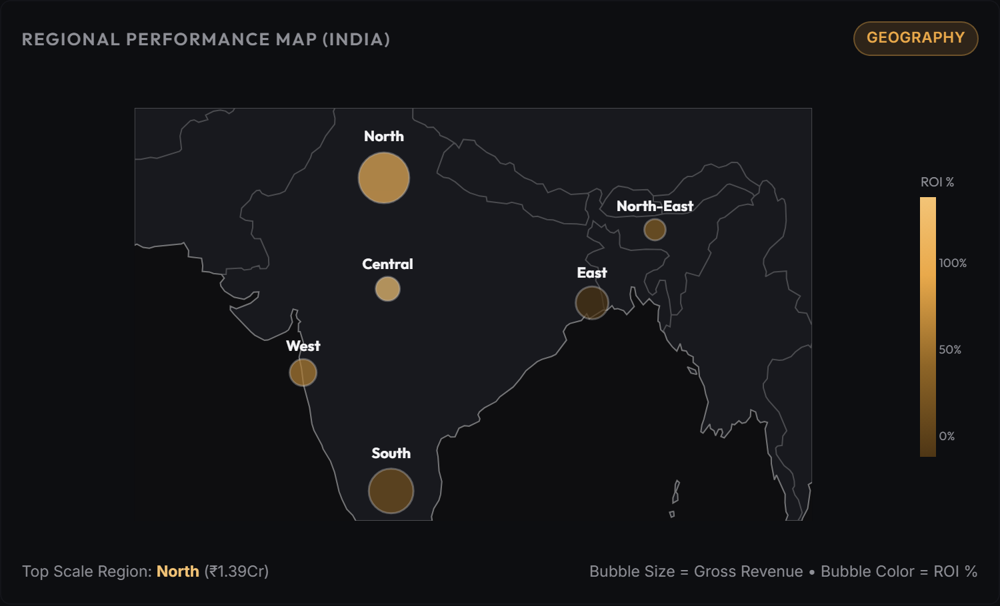](screenshots/08_regional_map.png) |
| *Audience cohort analysis across Tech Enthusiasts, Families, Working Professionals, and Students* | *Choropleth/scattergeo bubble map highlighting regional CAC, ROI, and revenue distributions across India* |

#### 🎯 Strategic Analysis, Forecasting & Simulation Tabs
| Filtered View (Google Deep-Dive) | Channel Insights & 3-Month Forecast |
| :---: | :---: |
| [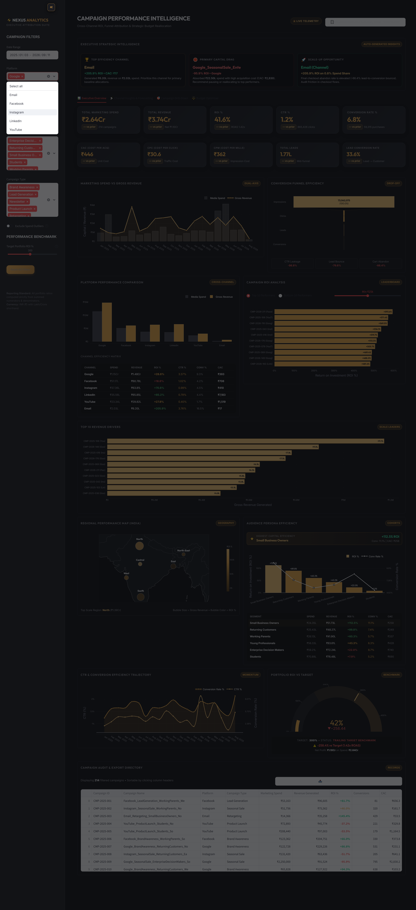](screenshots/09_filtered_view.png) | [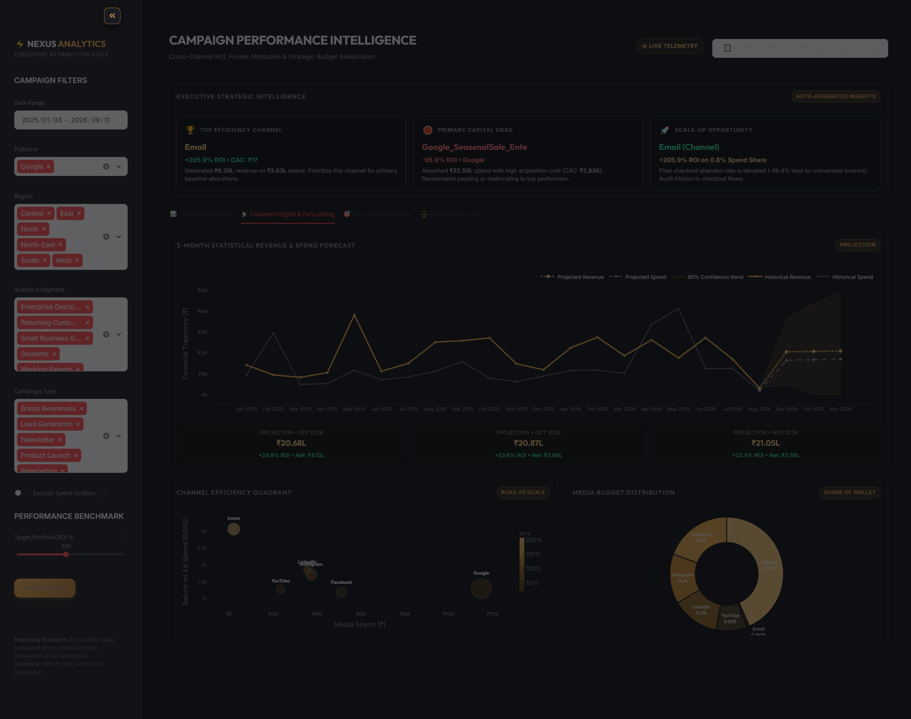](screenshots/10_channel_insights.png) |
| *Dynamic sidebar reactive filtering isolating Google search campaigns (₹1.15Cr spend, 60 campaigns)* | *Holt's Exponential Smoothing forecast with 95% confidence intervals and efficiency quadrant* |

| Campaign Drill-Down & Diagnostics | What-If Budget Optimiser Sandbox |
| :---: | :---: |
| [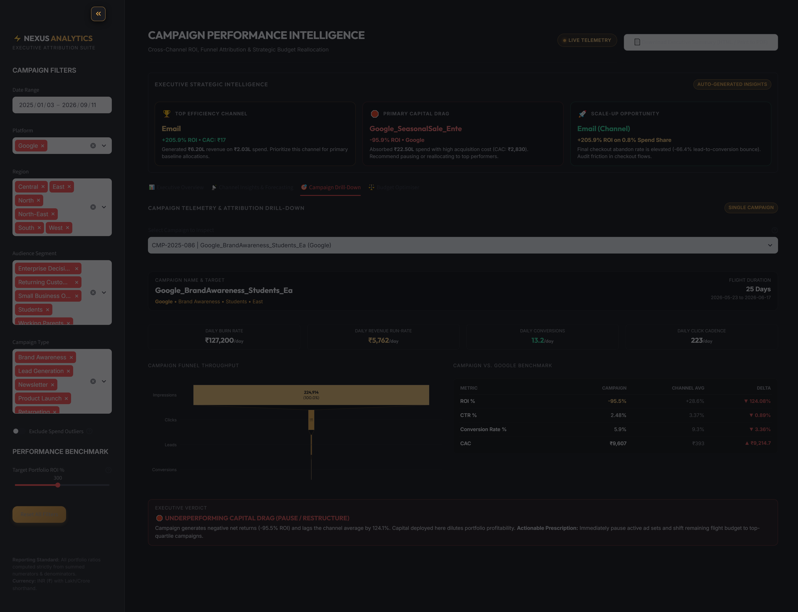](screenshots/11_campaign_drilldown.png) | [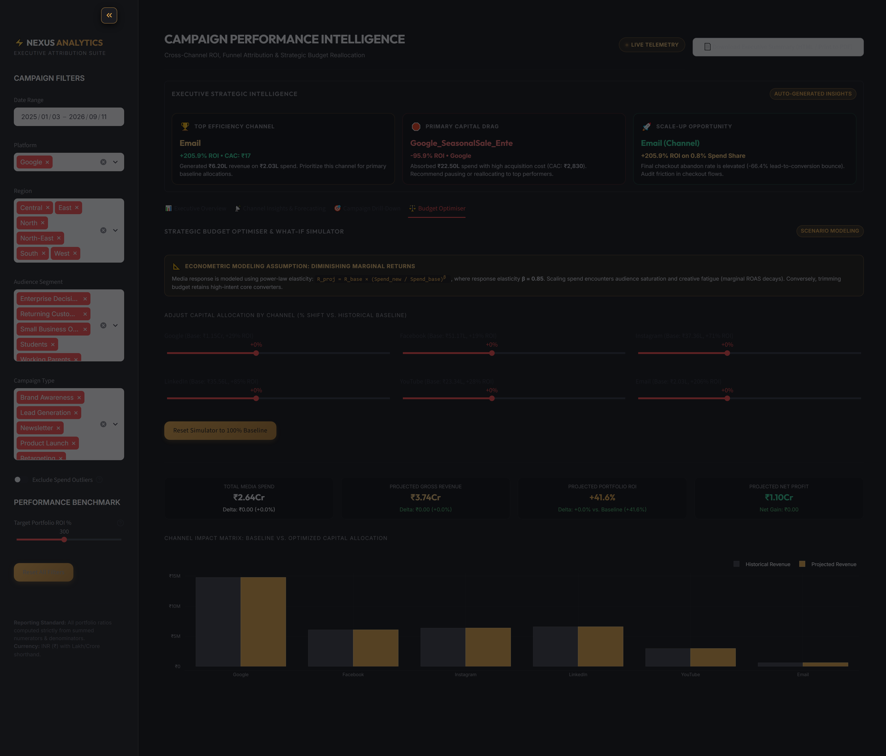](screenshots/12_budget_optimiser.png) |
| *Granular single-campaign telemetry, run-rate pacing, benchmark variances, and strategic verdict* | *Interactive capital reallocation sliders with non-linear diminishing-returns response curves ($\beta = 0.85$)* |

---

## 💡 Key Empirical Insights & Recommended Capital Shifts

*(Extracted from the full strategic report in [`reports/key_insights.md`](file:///reports/key_insights.md))*

1. **Email Marketing is Massively Underinvested at 205.95% ROI (Scale Immediately):**
   - **Data:** Email absorbed only **0.77% of total budget** (₹2.03L) but generated ₹6.20L revenue at a staggering **205.95% ROI** and an ultra-low CAC of **₹17.36** (vs. portfolio blended ₹445.66).
   - **Directive:** Triple Email allocation from ₹2.03L to ₹6.08L across lifecycle retention and cart-recovery drip campaigns.
2. **Instagram Outperforms Meta Stablemate Facebook in Conversion & Profitability:**
   - **Data:** Instagram delivered a **70.78% ROI** (ROAS 1.71x) at a CAC of **₹410.02**, whereas Facebook produced only **18.80% ROI** (ROAS 1.19x) at a higher CAC of **₹708.29**.
   - **Directive:** Shift **25% of Facebook's budget** (₹12.79L) into Instagram Reels, carousel shopping ads, and creator whitelisting.
3. **Google Search Budget Saturation & Rogue Spend Leakage:**
   - **Data:** Google absorbs **43.5% of total capital** (₹1.15Cr) but yields a modest **28.61% ROI**. In addition, 2 extreme spend outliers (> ₹22.5L each) were isolated on Google campaigns due to unconstrained broad-match bidding.
   - **Directive:** Enforce negative keyword audits, cap individual campaign budget thresholds at ₹2.5L, and trim Google search spend by **15% (₹17.23L)**.
4. **LinkedIn Captures High-Value B2B Enterprise Pipeline Despite High CPC:**
   - **Data:** Despite an elevated CPC of **₹316.90** (highest among all channels), LinkedIn achieved a strong **85.19% ROI** and generated ₹65.85L in revenue, driven by high customer contract value among Enterprise Decision Makers.
   - **Directive:** Protect LinkedIn budget for B2B Lead Generation while gating top-of-funnel content to qualify leads.
5. **Seasonal Capital Timing: Festive Quarters Yield Proven ROAS Multipliers:**
   - **Data:** Campaigns launched during the Q4 festive cycle (October–November) achieved an aggregate **2.92x ROAS**, representing a **+135.5% performance lift** compared to non-festive baseline months (1.24x ROAS).
   - **Directive:** Reserve **35% of annual media capital** specifically for the festive burst (Sep 15 - Nov 15).
6. **Portfolio Reallocation Impact:**
   - Reallocating **₹22.35L** from saturated Google and Facebook campaigns into Instagram and Email is projected to elevate blended portfolio ROI from **41.56% to ~60.06%**, yielding **~₹35L to ₹48L in incremental gross profit** without increasing total ad expenditure.

---

## ⚡ How to Run Locally

### Prerequisites
- Python 3.10, 3.11, or 3.12 installed.
- Git installed.

### Installation Steps

```bash
# 1. Clone the repository
git clone https://github.com/<your-username>/marketing-campaign-intelligence.git
cd marketing-campaign-intelligence

# 2. Create and activate a virtual environment
python -m venv .venv

# On Windows (PowerShell):
.\.venv\Scripts\Activate.ps1

# On macOS/Linux:
source .venv/bin/activate

# 3. Install dependencies
pip install -r requirements.txt

# 4. Run Pytest verification suite
pytest tests/ -v

# 5. Launch the Streamlit dashboard
streamlit run app/main.py
```

The application will launch locally at `http://localhost:8501`.

### 📸 Automated High-Resolution Screenshot Suite

The repository includes a headless Playwright automation engine to capture 4K production screenshots (1920x1200 @ 2x DPR) directly from the running Streamlit app:

```bash
# 1. Install development dependencies (kept separate from cloud deployment requirements)
pip install -r requirements-dev.txt

# 2. Install Playwright Chromium headless binaries
playwright install chromium

# 3. Run the automated screenshot capture suite
python src/capture_screenshots.py
```

The script spins up an ephemeral Streamlit instance on port 8599, synchronizes with Plotly SVG render layers, programmatically interacts with sidebar filters, navigates all executive tabs, captures 12 sharp PNG assets into `screenshots/`, and cleans up background processes automatically.

---

## 📂 Repository Structure

```text
marketing-campaign-dashboard/
│
├── .gitignore                     # Git ignore rules for Python, virtual environments, and OS files
├── requirements.txt               # Locked and validated project dependencies
├── requirements-dev.txt           # Developer tools (Playwright, Ruff) isolated from cloud runtime
├── pyproject.toml                 # Ruff linting & formatting configurations (Line length 120, PEP 8)
├── README.md                      # Comprehensive project documentation & architecture guide
│
├── data/
│   ├── raw/                       # Immutable raw campaign dataset (220 campaigns with defects)
│   │   └── marketing_campaigns_raw.csv
│   └── processed/                 # Cleaned, validated, and enriched dataset (214 rows x 30 columns)
│       └── marketing_campaigns_clean.csv
│
├── notebooks/                     # Exploratory Data Analysis & deep-dive prototyping
│   └── 01_eda_and_campaign_analysis.ipynb
│
├── src/                           # Core analytical modules and calculation engines
│   ├── __init__.py
│   ├── generate_data.py           # Domain-realistic raw data generator with seasonal lifts
│   ├── clean_data.py              # 6-step data cleaning, imputation, and outlier detection pipeline
│   ├── metrics.py                 # Single source of truth for all KPI calculations & aggregations
│   ├── forecasting.py             # Holt's Exponential Smoothing & prediction interval engine
│   └── capture_screenshots.py     # Headless Playwright automated screenshot generator (12 assets)
│
├── app/                           # Production Streamlit web application
│   ├── __init__.py
│   ├── main.py                    # Streamlit entry point, layout, and global sidebar filter state
│   ├── theme.py                   # Custom CSS styling, dark-gold palette, and Plotly templates
│   └── components/                # Modular UI widgets
│       ├── __init__.py
│       ├── card.py                # Reusable glassmorphic executive card container
│       ├── kpis.py                # Dual-tier KPI scorecards with dynamic period deltas
│       ├── performance.py         # ROI leaderboard, channel matrices, funnels, and trajectories
│       ├── audience_region.py     # India regional bubble map, audience cohorts, and directory table
│       ├── channel_insights.py    # Efficiency quadrants and 3-month predictive forecast
│       ├── drilldown.py           # Single-campaign telemetry, run-rates, and benchmark variances
│       ├── budget_optimizer.py    # Diminishing-returns what-if simulation sliders
│       ├── insights_panel.py      # Dynamic executive natural-language insight cards
│       └── export_report.py       # Print-ready executive HTML summary export generator
│
├── tests/                         # Pytest test suites and QA stress harnesses
│   ├── __init__.py
│   ├── test_metrics.py            # Unit tests for KPI math, zero-division, and aggregation rules
│   ├── qa_verify_numbers.py       # Independent raw Pandas mathematical verification script
│   └── qa_stress_test.py          # 24-scenario automated AppTest filter combination stress harness
│
├── docs/                          # Architecture specifications, interview prep, and career assets
│   ├── PROJECT_CONTEXT.md         # Source of truth for formulas, standards, and progress log
│   ├── resume_lines.md            # Resume bullets (1-line, 2-line, and ATS-friendly formats)
│   └── interview_prep.md          # 10 deep-dive technical and business interview Q&As
│
├── screenshots/                   # Production-grade 4K dashboard screenshot captures (12 assets)
│   ├── 01_full_dashboard.png      # Executive Overview full dashboard capture
│   ├── 02_kpi_cards.png           # Dual-tier executive KPI scorecards
│   ├── 03_campaign_performance.png# Campaign ROI analysis & revenue leaderboard
│   ├── 04_platform_comparison.png # Cross-platform performance & efficiency matrix
│   ├── 05_conversion_funnel.png   # Full conversion funnel with drop-off diagnostics
│   ├── 06_spend_vs_revenue.png    # Monthly spend bars vs gross revenue gold curve
│   ├── 07_audience_segments.png   # Audience persona efficiency cohorts
│   ├── 08_regional_map.png        # India regional performance scattergeo map
│   ├── 09_filtered_view.png       # Dynamic filtered view (Google channel isolation)
│   ├── 10_channel_insights.png    # Holt's exponential smoothing forecast & quadrants
│   ├── 11_campaign_drilldown.png  # Single-campaign deep dive & benchmark radar
│   └── 12_budget_optimiser.png    # Diminishing-returns budget simulation sandbox
│
└── reports/                       # Formal analytical and audit deliverables
    ├── data_quality_report.md     # In-depth cleaning, imputation, and outlier audit
    ├── key_insights.md            # Empirical findings and capital reallocation directives
    └── project_report.md          # 2-page formal business report for CMOs and Marketing Heads
```

---

## 💻 Tech Stack & Engineering Standards

| Category | Technology | Usage & Rationale |
| :--- | :--- | :--- |
| **Language** | **Python 3.12** | Core programming language |
| **Data Processing** | **Pandas & NumPy** | Ingestion, vectorized cleaning, grouped sum aggregations, and ratio calculations |
| **Web Application** | **Streamlit** | Multi-page executive UI, reactive state management, and interactive widgets |
| **Interactive Visuals** | **Plotly Graph Objects** | Custom dark-gold thematic charts, scatter geo maps, funnels, and dual-axis time series |
| **Predictive Modeling** | **Statsmodels** | Holt's Exponential Smoothing (additive trend + damping) and confidence bands |
| **Testing & QA** | **Pytest & Streamlit AppTest** | Unit testing for metric formulas (10 tests) and 24-combination headless UI stress test |
| **Code Quality** | **Ruff** | Blazing-fast PEP 8 linting, import sorting, and code formatting |

---

## 🔮 Future Roadmap & Enhancements

1. **Multi-Touch Attribution (MTA) Modeling:** Integrate algorithmic attribution models (Markov Chain Transition Matrices and Shapley Value game-theory attribution) to move beyond last-click attribution for top-of-funnel channels like YouTube.
2. **Customer Lifetime Value (LTV) & Cohort Retention:** Connect CRM post-conversion telemetry to measure 6-month and 12-month repeat order value, calculating true LTV:CAC ratios per acquisition channel.
3. **Live Ad Platform Connectors:** Implement automated ETL pipelines using Google Ads API, Meta Graph API, and LinkedIn Marketing Solutions API to refresh campaign telemetry in near-real-time.
4. **Automated Bayesian Budget Optimization:** Upgrade the what-if simulation engine to a Bayesian optimization model that automatically computes optimal budget distributions subject to target CAC constraints.

---

## 📄 License

This project is licensed under the MIT License - see the [LICENSE](LICENSE) file for details.
